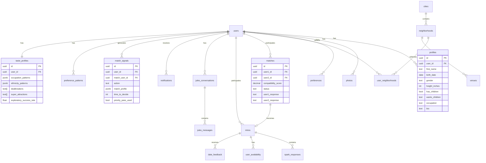

# Database Schema

Complete PostgreSQL schema for Project Jules, running on Supabase.

## Entity Relationship Diagram



## Tables Overview

| Table | Purpose | RLS |
|-------|---------|-----|
| `users` | Core user accounts (extends auth.users) | Own data only |
| `profiles` | User profile details | Own data only |
| `photos` | User photos | Own data only |
| `preferences` | Stated dating preferences | Own data only |
| `user_neighborhoods` | Where user wants to date | Own data only |
| `matches` | Potential match pairings | Own matches only |
| `intros` | Active matches post-acceptance | Own intros only |
| `spark_responses` | Spark Exchange answers | Own intro responses |
| `user_availability` | Scheduling time slots | Own availability |
| `date_feedback` | Post-date ratings | Own feedback |
| `venues` | Date locations | Public read |
| `neighborhoods` | NYC neighborhoods | Public read |
| `cities` | Active cities | Public read |
| `jules_conversations` | Chat threads | Own conversations |
| `jules_messages` | Individual messages | Own messages |
| `notifications` | Push/in-app notifications | Own notifications |
| `match_signals` | Behavioral learning data | Own signals |
| `preference_patterns` | Aggregated patterns | Own patterns |
| `taste_profiles` | Comprehensive preferences | Own profile |
| `exploratory_matches` | Outside-type experiments | Own experiments |
| `user_tokens` | Priority Passes & credits | Own tokens |

---

## Core Tables

### users

Extends Supabase `auth.users` with app-specific fields.

```sql
CREATE TABLE public.users (
    id UUID PRIMARY KEY REFERENCES auth.users(id) ON DELETE CASCADE,
    phone TEXT UNIQUE NOT NULL,
    status TEXT NOT NULL DEFAULT 'onboarding'
        CHECK (status IN ('onboarding', 'active', 'paused', 'banned')),
    subscription_tier TEXT NOT NULL DEFAULT 'explorer'
        CHECK (subscription_tier IN ('explorer', 'member', 'unlimited')),
    subscription_expires_at TIMESTAMPTZ,
    created_at TIMESTAMPTZ NOT NULL DEFAULT NOW(),
    updated_at TIMESTAMPTZ NOT NULL DEFAULT NOW()
);
```

| Column | Type | Description |
|--------|------|-------------|
| id | UUID | Links to auth.users |
| phone | TEXT | Unique phone number |
| status | TEXT | onboarding → active → paused/banned |
| subscription_tier | TEXT | explorer (free), member ($29), unlimited ($79) |
| subscription_expires_at | TIMESTAMPTZ | When paid subscription ends |

### profiles

User profile information displayed to potential matches.

```sql
CREATE TABLE public.profiles (
    id UUID PRIMARY KEY DEFAULT uuid_generate_v4(),
    user_id UUID NOT NULL REFERENCES public.users(id) ON DELETE CASCADE,
    first_name TEXT NOT NULL,
    birth_date DATE NOT NULL,
    gender TEXT NOT NULL CHECK (gender IN ('man', 'woman', 'nonbinary')),
    height_inches INTEGER,
    has_children BOOLEAN,
    wants_children TEXT CHECK (wants_children IN ('yes', 'no', 'someday', 'not_sure')),
    occupation TEXT,
    education TEXT,
    bio TEXT,
    ethnicity TEXT,
    religion TEXT,
    created_at TIMESTAMPTZ NOT NULL DEFAULT NOW(),
    updated_at TIMESTAMPTZ NOT NULL DEFAULT NOW(),
    UNIQUE(user_id)
);
```

### preferences

What the user says they're looking for.

```sql
CREATE TABLE public.preferences (
    id UUID PRIMARY KEY DEFAULT uuid_generate_v4(),
    user_id UUID NOT NULL REFERENCES public.users(id) ON DELETE CASCADE,
    interested_in TEXT[] NOT NULL DEFAULT '{}',
    min_age INTEGER NOT NULL DEFAULT 18,
    max_age INTEGER NOT NULL DEFAULT 99,
    min_height_inches INTEGER,
    max_height_inches INTEGER,
    max_distance_miles INTEGER DEFAULT 25,
    open_to_has_children BOOLEAN DEFAULT TRUE,
    open_to_wants_children BOOLEAN DEFAULT TRUE,
    dealbreakers TEXT[] DEFAULT '{}',
    created_at TIMESTAMPTZ NOT NULL DEFAULT NOW(),
    updated_at TIMESTAMPTZ NOT NULL DEFAULT NOW(),
    UNIQUE(user_id)
);
```

---

## Matching Tables

### matches

Potential pairings identified by Jules AI.

```sql
CREATE TABLE public.matches (
    id UUID PRIMARY KEY DEFAULT uuid_generate_v4(),
    user1_id UUID NOT NULL REFERENCES public.users(id) ON DELETE CASCADE,
    user2_id UUID NOT NULL REFERENCES public.users(id) ON DELETE CASCADE,
    compatibility_score DECIMAL(3, 2),
    jules_reasoning TEXT,
    status TEXT NOT NULL DEFAULT 'pending'
        CHECK (status IN ('pending', 'pitched', 'accepted', 'declined', 'expired')),
    pitched_to_user1_at TIMESTAMPTZ,
    pitched_to_user2_at TIMESTAMPTZ,
    user1_response TEXT CHECK (user1_response IN ('accepted', 'declined')),
    user2_response TEXT CHECK (user2_response IN ('accepted', 'declined')),
    priority_pass_used_by UUID REFERENCES public.users(id),
    is_exploratory BOOLEAN DEFAULT FALSE,
    exploratory_hypothesis TEXT,
    created_at TIMESTAMPTZ NOT NULL DEFAULT NOW(),
    updated_at TIMESTAMPTZ NOT NULL DEFAULT NOW(),
    UNIQUE(user1_id, user2_id)
);
```

**Status Flow:**
```
pending → pitched → accepted/declined/expired
           ↓
    Both accept → Create intro
```

### intros

Active matches after both users accept.

```sql
CREATE TABLE public.intros (
    id UUID PRIMARY KEY DEFAULT uuid_generate_v4(),
    match_id UUID NOT NULL REFERENCES public.matches(id) ON DELETE CASCADE,
    user1_id UUID NOT NULL REFERENCES public.users(id),
    user2_id UUID NOT NULL REFERENCES public.users(id),
    status TEXT NOT NULL DEFAULT 'spark_exchange'
        CHECK (status IN ('spark_exchange', 'scheduling', 'scheduled', 'completed', 'cancelled')),
    scheduled_at TIMESTAMPTZ,
    venue_id UUID REFERENCES public.venues(id),
    cancelled_by UUID REFERENCES public.users(id),
    cancellation_reason TEXT,
    created_at TIMESTAMPTZ NOT NULL DEFAULT NOW(),
    updated_at TIMESTAMPTZ NOT NULL DEFAULT NOW(),
    UNIQUE(match_id)
);
```

**Status Flow:**
```
spark_exchange → scheduling → scheduled → completed
      ↓              ↓            ↓
   (expired)     (cancelled)  (cancelled)
```

---

## Preference Learning Tables

### match_signals

Every yes/no decision teaches Jules something.

```sql
CREATE TABLE match_signals (
    id UUID PRIMARY KEY DEFAULT gen_random_uuid(),
    user_id UUID REFERENCES users(id) ON DELETE CASCADE,
    match_user_id UUID REFERENCES users(id) ON DELETE CASCADE,
    action TEXT NOT NULL,
        -- accepted, declined, expired, super_liked, second_date, no_second_date
    match_profile JSONB NOT NULL,  -- Snapshot at decision time
    time_to_decide INT,            -- Seconds (quick yes = strong interest)
    asked_jules_first BOOLEAN DEFAULT FALSE,
    priority_pass_used BOOLEAN DEFAULT FALSE,
    source TEXT NOT NULL,
        -- match_presentation, spark_exchange, post_date, conversation
    created_at TIMESTAMPTZ DEFAULT NOW()
);

CREATE INDEX idx_match_signals_user ON match_signals(user_id, created_at DESC);
```

**match_profile JSONB structure:**
```json
{
  "age": 28,
  "gender": "woman",
  "height_inches": 66,
  "occupation": "Product Designer",
  "education": "NYU",
  "ethnicity": "asian",
  "has_children": false,
  "wants_children": "someday",
  "photo_styles": ["urban", "artistic"],
  "bio_keywords": ["travel", "coffee", "dogs"],
  "interests": ["hiking", "photography"]
}
```

### preference_patterns

Aggregated patterns learned from signals.

```sql
CREATE TABLE preference_patterns (
    id UUID PRIMARY KEY DEFAULT gen_random_uuid(),
    user_id UUID REFERENCES users(id) ON DELETE CASCADE,
    category TEXT NOT NULL,
        -- physical, demographics, lifestyle, personality, logistics
    attribute TEXT NOT NULL,
        -- occupation_type, height_range, ethnicity, etc.
    value TEXT NOT NULL,
        -- "creative", "5_8_to_6_0", "asian", etc.
    yes_count INT DEFAULT 0,
    no_count INT DEFAULT 0,
    total_exposures INT DEFAULT 0,
    acceptance_rate DOUBLE PRECISION DEFAULT 0,
    strength TEXT DEFAULT 'emerging',
        -- emerging (<5), developing (5-15), established (15-30), strong (30+)
    last_updated TIMESTAMPTZ DEFAULT NOW(),
    notes TEXT,
    UNIQUE(user_id, attribute, value)
);

CREATE INDEX idx_preference_patterns_user ON preference_patterns(user_id, attribute);
CREATE INDEX idx_preference_patterns_strength ON preference_patterns(user_id, strength, acceptance_rate DESC);
```

### taste_profiles

Comprehensive taste profile per user.

```sql
CREATE TABLE taste_profiles (
    id UUID PRIMARY KEY DEFAULT gen_random_uuid(),
    user_id UUID REFERENCES users(id) ON DELETE CASCADE UNIQUE,

    -- Physical preferences
    height_preference JSONB,
    body_type_patterns JSONB DEFAULT '{}',
    style_preferences JSONB DEFAULT '{}',

    -- Demographic patterns
    age_pattern_min INT,
    age_pattern_max INT,
    ethnicity_patterns JSONB DEFAULT '{}',
    religion_patterns JSONB DEFAULT '{}',

    -- Lifestyle patterns
    occupation_patterns JSONB DEFAULT '{}',
    education_patterns JSONB DEFAULT '{}',
    kids_preference_observed TEXT,

    -- Personality patterns
    interest_affinities JSONB DEFAULT '{}',
    bio_keyword_affinities JSONB DEFAULT '{}',

    -- Meta patterns
    decides_quickly_on TEXT[] DEFAULT '{}',
    needs_time_on TEXT[] DEFAULT '{}',
    dealbreakers TEXT[] DEFAULT '{}',
    super_attractions TEXT[] DEFAULT '{}',

    -- Exploration tracking
    last_exploratory_match TIMESTAMPTZ,
    exploratory_success_rate DOUBLE PRECISION DEFAULT 0,

    updated_at TIMESTAMPTZ DEFAULT NOW()
);
```

**Pattern JSONB structure (e.g., occupation_patterns):**
```json
{
  "creative": 0.85,     // 85% acceptance rate
  "tech": 0.70,
  "finance": 0.30,
  "healthcare": 0.60
}
```

### exploratory_matches

Tracking matches outside user's usual type.

```sql
CREATE TABLE exploratory_matches (
    id UUID PRIMARY KEY DEFAULT gen_random_uuid(),
    match_id UUID REFERENCES matches(id) ON DELETE CASCADE,
    user_id UUID REFERENCES users(id) ON DELETE CASCADE,
    hypothesis TEXT NOT NULL,
        -- "Testing if they connect with finance types"
    differing_attributes TEXT[] DEFAULT '{}',
        -- ["occupation_type:finance", "height_range:over_6_0"]
    outcome TEXT,
        -- accepted, declined, super_liked, second_date
    created_at TIMESTAMPTZ DEFAULT NOW()
);
```

---

## Tokens & Credits

### user_tokens

Priority Passes and date credits.

```sql
CREATE TABLE user_tokens (
    id UUID PRIMARY KEY DEFAULT gen_random_uuid(),
    user_id UUID REFERENCES users(id) ON DELETE CASCADE UNIQUE,
    priority_passes INT DEFAULT 0,
    date_credits INT DEFAULT 0,
    last_refreshed TIMESTAMPTZ DEFAULT NOW(),
    created_at TIMESTAMPTZ DEFAULT NOW(),
    updated_at TIMESTAMPTZ DEFAULT NOW()
);
```

**Token allocation by tier:**

| Tier | Priority Passes/Month | Date Credits |
|------|----------------------|--------------|
| Explorer | 0 | Pay per date ($15) |
| Member | 1 | Reduced per date ($8) |
| Unlimited | 3 | Unlimited |

### priority_pass_usage

Track Priority Pass effectiveness.

```sql
CREATE TABLE priority_pass_usage (
    id UUID PRIMARY KEY DEFAULT gen_random_uuid(),
    from_user_id UUID REFERENCES users(id) ON DELETE CASCADE,
    to_user_id UUID REFERENCES users(id) ON DELETE CASCADE,
    used_at TIMESTAMPTZ DEFAULT NOW(),
    resulted_in_match BOOLEAN DEFAULT FALSE
);
```

---

## Location Tables

### cities

Active cities for the app.

```sql
CREATE TABLE public.cities (
    id TEXT PRIMARY KEY,           -- 'nyc'
    name TEXT NOT NULL,            -- 'New York City'
    state TEXT,                    -- 'NY'
    country TEXT NOT NULL DEFAULT 'US',
    is_active BOOLEAN NOT NULL DEFAULT FALSE,
    timezone TEXT NOT NULL DEFAULT 'America/New_York',
    created_at TIMESTAMPTZ NOT NULL DEFAULT NOW()
);
```

### neighborhoods

Dating neighborhoods within cities.

```sql
CREATE TABLE public.neighborhoods (
    id TEXT PRIMARY KEY,           -- 'west_village'
    city_id TEXT NOT NULL REFERENCES public.cities(id),
    name TEXT NOT NULL,            -- 'West Village'
    latitude DECIMAL(10, 8),
    longitude DECIMAL(11, 8),
    is_active BOOLEAN NOT NULL DEFAULT TRUE,
    created_at TIMESTAMPTZ NOT NULL DEFAULT NOW()
);
```

**NYC Neighborhoods (pre-seeded):**
- Manhattan: Tribeca, SoHo, West Village, East Village, LES, Chelsea, Gramercy, Flatiron, Murray Hill, UES, UWS, Harlem
- Brooklyn: Williamsburg, DUMBO, Brooklyn Heights, Cobble Hill, Park Slope, Fort Greene, Greenpoint, Bushwick, Prospect Heights
- Other: Astoria, LIC, Jersey City, Hoboken

### venues

Date locations.

```sql
CREATE TABLE public.venues (
    id UUID PRIMARY KEY DEFAULT uuid_generate_v4(),
    neighborhood_id TEXT NOT NULL REFERENCES public.neighborhoods(id),
    name TEXT NOT NULL,
    address TEXT NOT NULL,
    latitude DECIMAL(10, 8),
    longitude DECIMAL(11, 8),
    venue_type TEXT NOT NULL
        CHECK (venue_type IN ('restaurant', 'bar', 'coffee', 'activity', 'park')),
    vibe TEXT CHECK (vibe IN ('casual', 'upscale', 'trendy', 'cozy', 'lively')),
    price_range TEXT CHECK (price_range IN ('$', '$$', '$$$', '$$$$')),
    noise_level TEXT CHECK (noise_level IN ('quiet', 'moderate', 'loud')),
    photo_url TEXT,
    google_place_id TEXT,
    is_partner BOOLEAN NOT NULL DEFAULT FALSE,
    is_active BOOLEAN NOT NULL DEFAULT TRUE,
    created_at TIMESTAMPTZ NOT NULL DEFAULT NOW(),
    updated_at TIMESTAMPTZ NOT NULL DEFAULT NOW()
);
```

---

## Jules AI Tables

### jules_conversations

Chat threads with Jules.

```sql
CREATE TABLE public.jules_conversations (
    id UUID PRIMARY KEY DEFAULT uuid_generate_v4(),
    user_id UUID NOT NULL REFERENCES public.users(id) ON DELETE CASCADE,
    context TEXT NOT NULL DEFAULT 'general'
        CHECK (context IN ('onboarding', 'general', 'match_pitch', 'scheduling', 'feedback')),
    related_intro_id UUID REFERENCES public.intros(id),
    is_active BOOLEAN NOT NULL DEFAULT TRUE,
    created_at TIMESTAMPTZ NOT NULL DEFAULT NOW(),
    updated_at TIMESTAMPTZ NOT NULL DEFAULT NOW()
);
```

### jules_messages

Individual messages in conversations.

```sql
CREATE TABLE public.jules_messages (
    id UUID PRIMARY KEY DEFAULT uuid_generate_v4(),
    conversation_id UUID NOT NULL REFERENCES public.jules_conversations(id) ON DELETE CASCADE,
    role TEXT NOT NULL CHECK (role IN ('user', 'jules', 'system')),
    content TEXT NOT NULL,
    message_type TEXT DEFAULT 'text'
        CHECK (message_type IN ('text', 'match_card', 'spark_prompt', 'schedule_request', 'quick_reply')),
    metadata JSONB,
    created_at TIMESTAMPTZ NOT NULL DEFAULT NOW()
);
```

---

## Row Level Security

All tables have RLS enabled. Key policies:

```sql
-- Users can only see/modify their own data
CREATE POLICY "Users can view own data" ON public.users
    FOR SELECT USING (auth.uid() = id);

-- Matches visible to both participants
CREATE POLICY "Users can view own matches" ON public.matches
    FOR SELECT USING (auth.uid() = user1_id OR auth.uid() = user2_id);

-- Intros visible to both participants
CREATE POLICY "Users can view own intros" ON public.intros
    FOR SELECT USING (auth.uid() = user1_id OR auth.uid() = user2_id);

-- Preference learning data is private
CREATE POLICY "Users view own signals" ON match_signals
    FOR SELECT USING (auth.uid() = user_id);
```

---

## Indexes

Performance indexes for common queries:

```sql
-- User lookups
CREATE INDEX idx_profiles_user_id ON public.profiles(user_id);
CREATE INDEX idx_photos_user_id ON public.photos(user_id);
CREATE INDEX idx_preferences_user_id ON public.preferences(user_id);

-- Match queries
CREATE INDEX idx_matches_user1 ON public.matches(user1_id);
CREATE INDEX idx_matches_user2 ON public.matches(user2_id);
CREATE INDEX idx_matches_status ON public.matches(status);

-- Intro queries
CREATE INDEX idx_intros_user1 ON public.intros(user1_id);
CREATE INDEX idx_intros_user2 ON public.intros(user2_id);
CREATE INDEX idx_intros_status ON public.intros(status);

-- Learning system
CREATE INDEX idx_match_signals_user ON match_signals(user_id, created_at DESC);
CREATE INDEX idx_preference_patterns_user ON preference_patterns(user_id, attribute);
CREATE INDEX idx_preference_patterns_strength ON preference_patterns(user_id, strength, acceptance_rate DESC);

-- Jules conversations
CREATE INDEX idx_jules_conversations_user ON public.jules_conversations(user_id);
CREATE INDEX idx_jules_messages_conversation ON public.jules_messages(conversation_id);
```

---

## Triggers

Auto-update `updated_at` timestamps:

```sql
CREATE OR REPLACE FUNCTION update_updated_at_column()
RETURNS TRIGGER AS $$
BEGIN
    NEW.updated_at = NOW();
    RETURN NEW;
END;
$$ language 'plpgsql';

-- Applied to: users, profiles, preferences, matches, intros,
--            jules_conversations, communication_profiles,
--            learned_preferences, venues, taste_profiles
```
