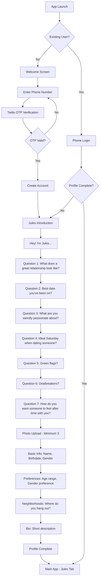
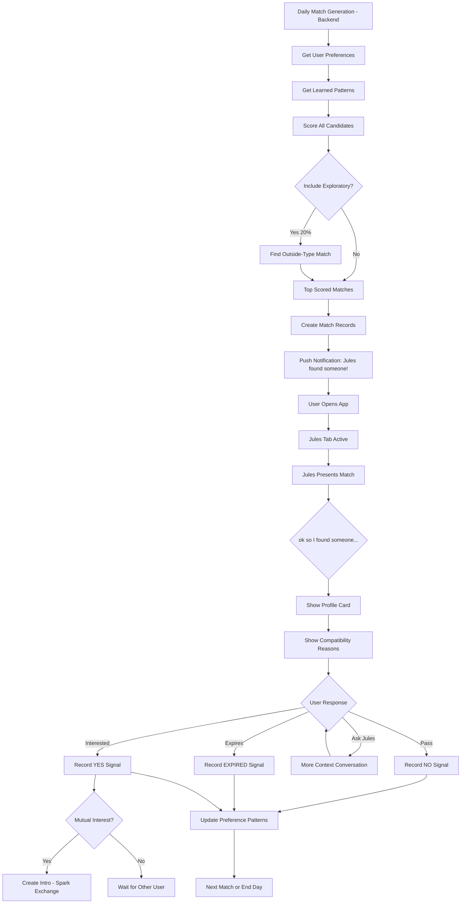
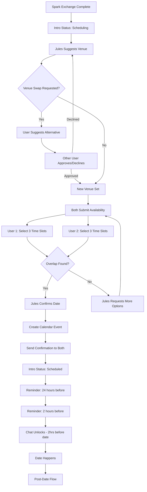
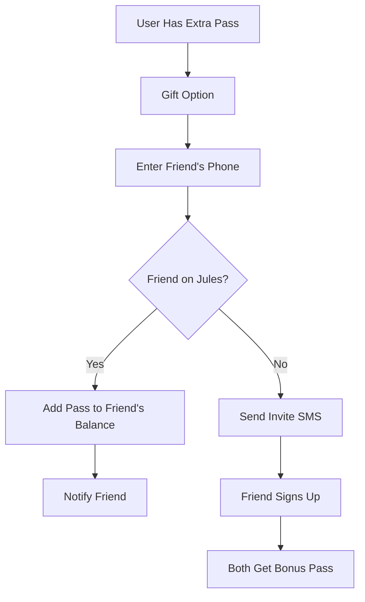
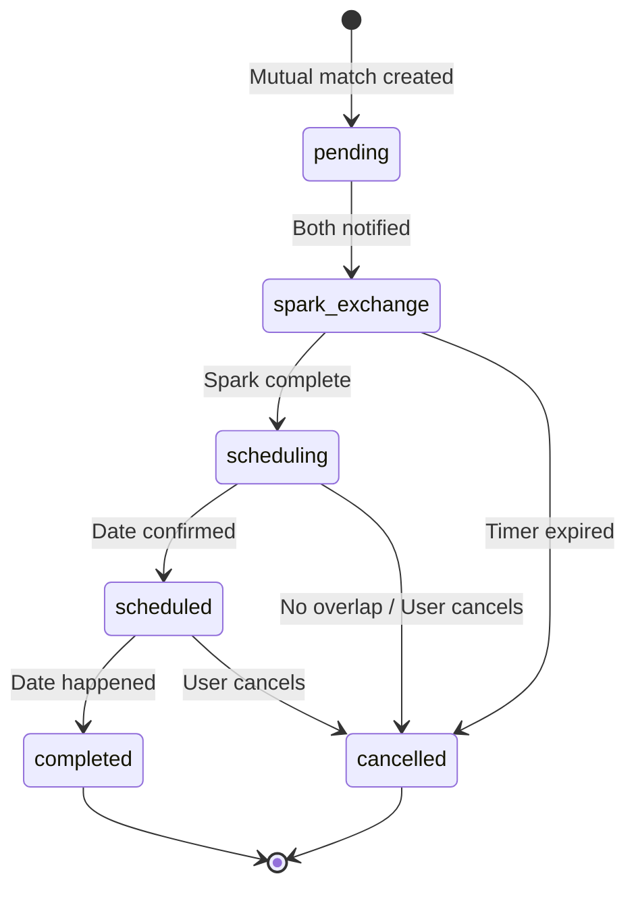

# User Flows

Complete user journey documentation for Project Jules.

## Table of Contents
1. [Onboarding Flow](#onboarding-flow)
2. [Daily Match Flow](#daily-match-flow)
3. [Spark Exchange Flow](#spark-exchange-flow)
4. [Date Scheduling Flow](#date-scheduling-flow)
5. [Post-Date Flow](#post-date-flow)
6. [Priority Pass Flow](#priority-pass-flow)

---

## Onboarding Flow

New user signup and Jules introduction.



### Onboarding Questions (Jules Asks)

| # | Question Theme | Purpose |
|---|----------------|---------|
| 1 | Great relationship | Understand relationship goals |
| 2 | Best date ever | Learn what experiences resonate |
| 3 | Weird passion | Find unique compatibility angles |
| 4 | Ideal Saturday | Lifestyle compatibility |
| 5 | Green flags | Attraction patterns |
| 6 | Dealbreakers | Hard no's to avoid |
| 7 | Desired feeling | Emotional goals |

---

## Daily Match Flow

How Jules presents matches each day.



### Match Presentation by Tier

| Tier | Matches/Day | Priority Pass Boost |
|------|-------------|---------------------|
| Explorer | 1 | Shown but not highlighted |
| Member | 2 | "Someone used their Priority Pass on you" |
| Unlimited | 3 | Full Priority Pass visibility |

---

## Spark Exchange Flow

Pre-date conversation to build anticipation.

```mermaid
flowchart TD
    A[Mutual Match Created] --> B[Create Intro Record]
    B --> C[Generate Spark Prompts]
    C --> D[Notify Both Users]

    D --> E[User Opens Spark Exchange]
    E --> F[See Prompt 1]
    F --> G{Voice Note Available?}

    G -->|Member/Unlimited| H[Record Voice or Type]
    G -->|Explorer| I[Type Response Only]

    H --> J[Submit Answer 1]
    I --> J

    J --> K[See Prompt 2]
    K --> L[Submit Answer 2]

    L --> M{Other User Done?}
    M -->|No| N[Wait Screen - Timer]
    M -->|Yes| O[Reveal Responses]

    N --> P{Timer Expired?}
    P -->|Yes| Q[Intro Cancelled]
    P -->|No| M

    O --> R[Both See Each Other's Answers]
    R --> S[Jules Facilitates: "love that you both..."]
    S --> T[Move to Scheduling]
```

### Spark Prompt Examples

```
- "What's something you're looking forward to this week?"
- "Describe your perfect lazy Sunday morning"
- "What's a hill you'll die on that's completely unimportant?"
- "Best meal you've had recently - where and what?"
- "What would you do with an unexpected day off?"
```

### Voice Note Limits

| Tier | Voice Notes | Duration |
|------|-------------|----------|
| Explorer | Not available | - |
| Member | Available | 30 seconds |
| Unlimited | Available | 60 seconds |

---

## Date Scheduling Flow

Coordinating the actual meetup.



### Venue Selection Logic

1. **Preference Match**: Check both users' venue preferences
2. **Neighborhood Overlap**: Find convenient locations
3. **Venue Type**: Coffee, drinks, dinner, activity
4. **Time of Day**: Appropriate for selected time
5. **Tier Consideration**: Premium venues for Unlimited users

---

## Post-Date Flow

Learning from real-world outcomes.

```mermaid
flowchart TD
    A[Date Time Passes] --> B[Wait 2 Hours]
    B --> C[Push: "so?? how'd it go?"]

    C --> D[User Opens Jules Chat]
    D --> E[Jules Asks About Date]

    E --> F[Rating Selection]
    F --> G{Rating?}

    G -->|Amazing| H[Record SECOND_DATE Signal - 2x weight]
    G -->|Good| I[Record Positive Signal]
    G -->|Fine| J[Record Neutral Signal]
    G -->|Not Great| K[Record NO_SECOND_DATE Signal]

    H --> L[Want Second Date: Yes]
    I --> L
    J --> M[Want Second Date: Maybe]
    K --> N[Want Second Date: No]

    L --> O[Feedback Tags]
    M --> O
    N --> O

    O --> P[Optional Text Feedback]
    P --> Q[Venue Rating]

    Q --> R[Update Preference Patterns]
    R --> S[Update Taste Profile]

    S --> T{Both Want Second Date?}
    T -->|Yes| U[Jules Facilitates Second Date]
    T -->|No| V[Intro Completed]

    U --> W[Direct Chat Unlocked]
    V --> X[Archive Intro]
```

### Feedback Tags

```
Positive:
- Great conversation
- Felt comfortable
- Attractive
- Funny
- Shared interests
- Want to see again

Negative:
- Awkward silences
- Different in person
- No chemistry
- Late/no-show
- Venue issue
- Not as described
```

---

## Priority Pass Flow

Signaling strong interest.

```mermaid
flowchart TD
    A[User Views Match] --> B{Has Priority Pass?}

    B -->|No| C[Standard Accept]
    B -->|Yes| D[Option: Use Priority Pass]

    D --> E{Use Pass?}
    E -->|No| C
    E -->|Yes| F[Deduct Pass from Balance]

    F --> G[Record SUPER_LIKED Signal]
    G --> H[Flag Match as Priority]

    H --> I[Recipient's Queue]
    I --> J[Move to Front of Queue]
    J --> K[Jules: "Someone used their Priority Pass on you"]

    K --> L{Recipient Response}
    L -->|Accept| M[Mutual Match - Record Priority Success]
    L -->|Decline| N[Record Priority Failure]

    M --> O[Spark Exchange with Priority Flag]
    N --> P[Update Pass Effectiveness]
```

### Priority Pass Allocation

| Tier | Passes/Month | Rollover |
|------|--------------|----------|
| Explorer | 0 | - |
| Member | 1 | No |
| Unlimited | 3 | No |

### Gifting Priority Passes



---

## State Diagram: Intro Lifecycle



---

## Preference Learning Integration

Every flow touchpoint feeds the learning system:

| Touchpoint | Signal Type | Weight |
|------------|-------------|--------|
| Accept match | Positive | 1x |
| Decline match | Negative | 1x |
| Let expire | Weak negative | 0.5x |
| Use Priority Pass | Strong positive | 2x |
| Quick decision (< 10s) | Confidence boost | 1.5x |
| Ask Jules first | Uncertainty flag | 0.8x |
| Want second date | Strong positive | 2x |
| No second date | Strong negative | 2x |
| Exploratory accepted | Pattern expansion | 1.5x |
